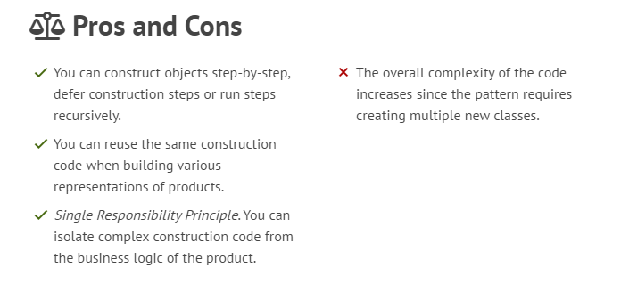

Builder is a creational design pattern that lets you construct complex objects step by step. The pattern allows you to produce different types and representations of an object using the same construction code.

How to Implement
Make sure that you can clearly define the common construction steps for building all available product representations. Otherwise, you won’t be able to proceed with implementing the pattern.

Declare these steps in the base builder interface.

Create a concrete builder class for each of the product representations and implement their construction steps.

Don’t forget about implementing a method for fetching the result of the construction. The reason why this method can’t be declared inside the builder interface is that various builders may construct products that don’t have a common interface. Therefore, you don’t know what would be the return type for such a method. However, if you’re dealing with products from a single hierarchy, the fetching method can be safely added to the base interface.

Think about creating a director class. It may encapsulate various ways to construct a product using the same builder object.

The client code creates both the builder and the director objects. Before construction starts, the client must pass a builder object to the director. Usually, the client does this only once, via parameters of the director’s class constructor. The director uses the builder object in all further construction. There’s an alternative approach, where the builder is passed to a specific product construction method of the director.

The construction result can be obtained directly from the director only if all products follow the same interface. Otherwise, the client should fetch the result from the builder.

Builder focuses on constructing complex objects step by step. Abstract Factory specializes in creating families of related objects. Abstract Factory returns the product immediately, whereas Builder lets you run some additional construction steps before fetching the product.

You can use Builder when creating complex Composite trees because you can program its construction steps to work recursively.

You can combine Builder with Bridge: the director class plays the role of the abstraction, while different builders act as implementations.

Abstract Factories, Builders and Prototypes can all be implemented as Singletons.