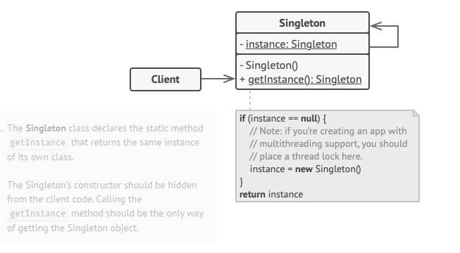
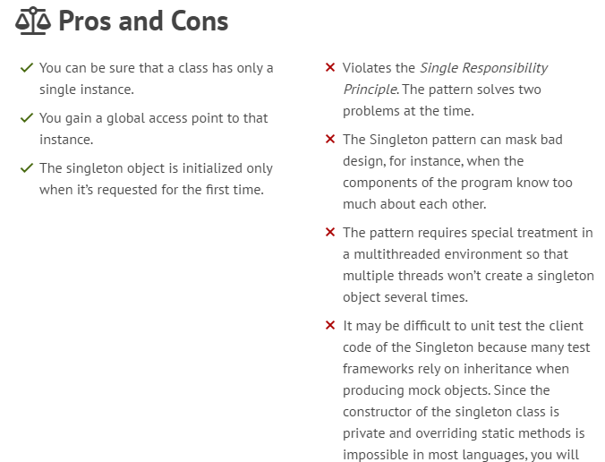

Singleton is a creational design pattern that lets you ensure that a class has only one instance, while providing a global access point to this instance.

All implementations of the Singleton have these two steps in common:

Make the default constructor private, to prevent other objects from using the new operator with the Singleton class.
Create a static creation method that acts as a constructor. Under the hood, this method calls the private constructor to create an object and saves it in a static field. All following calls to this method return the cached object.

Example 

The government is an excellent example of the Singleton pattern. A country can have only one official government. Regardless of the personal identities of the individuals who form governments, the title, “The Government of X”, is a global point of access that identifies the group of people in charge.

